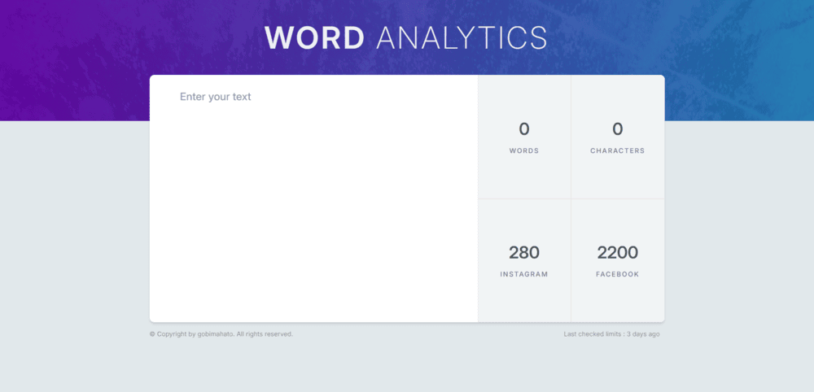

# Word Analytics

### Word Analytics is a web application that provides real-time analysis of text input. It calculates the number of words, characters, and the remaining characters for social media platforms like Instagram and Facebook.



## 🔗 [View on Netlify](https://word-analytics-gobi.netlify.app/)

## Features

- Real-time <b> word and character </b> count
- Remaining character count for <b> Instagram and Facebook </b>
- Simple and intuitive user interface

## 📌 Getting Started

### 1️⃣ Clone the Repository

```sh
git clone https://github.com/gobimahato/word-analytics.git
cd word-analytics
```

### 2️⃣ Install Dependencies

```sh
npm install
```

### 3️⃣ Run the Application

```sh
  npm run dev
```

Your app will now be live at http://localhost:5173/ (or the displayed URL).

### 📜 License

This project is licensed under the MIT License.
